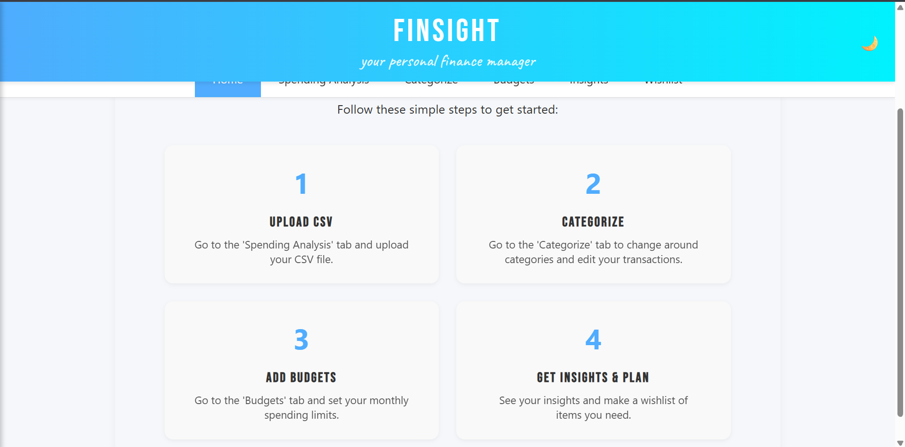
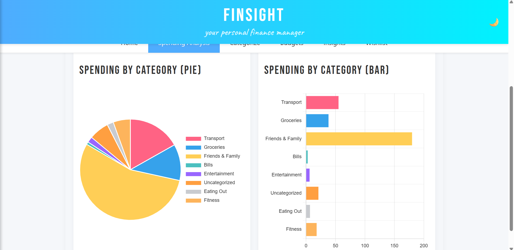

# FinSight

A personal finance analytics web app.
Upload your bank CSV, track spending by category, 
set budgets and financial goals, manage a wishlist, 
and even toggle between light/dark themes.

## 🔗 Live Demo
https://finsightonline.netlify.app

## Features
- CSV ingestion with parsers for different bank formats
- Smart auto-categorisation using 15+ regex rule sets
- Interactive Chart.js pie + bar charts by spending category
- Monthly budget tracker with overspend alerts
- Wishlist with suggested purchase order
- Dark mode
- Fully offline
- Mobile responsive

## Tech Stack
JavaScript · HTML/CSS · Chart.js · localStorage API

## Architecture
Client-side only — no backend required. All data persists
in localStorage. Originally built with a Node.js/Express/
MySQL backend; this is the offline demo version.

## Run Locally
Just open index.html in any browser. No install needed.

## Screenshots

